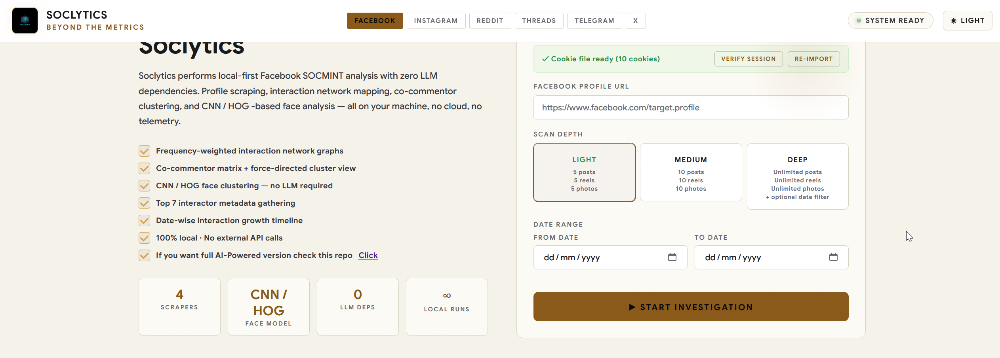

## What is Soclytics?

Soclytics is a local-first, dependency-light multi-platform SOCMINT platform. It runs six separate mini-apps — **Facebook**, **Instagram**, **Reddit**, **Threads**, **Telegram**, and **X** — each with its own cookies, database, and investigation history.

Each platform performs the same core workflow — data gathering, interaction mapping, network visualization, and (where applicable) face clustering — without requiring any AI model, Docker container, or cloud service.

Everything runs on your local machine. No GPU required. No model downloads. No official platform APIs.




---

# Soclytics Features

Local-first multi-platform SOCMINT. No LLM. No official social APIs.

---

## Platforms

- **Facebook** — about, photos, reels, posts + comments; face clustering
- **Instagram** — about, posts, reels + comments; face clustering
- **Reddit** — about, submissions + comments; **no** face step
- **Threads** — about, posts across tabs; face clustering
- **Telegram** — posts/media + interactors (MTProto or public preview)
- **X** — posts + counts; **Views (X-only)**; face clustering

Each platform has its own cookies/session, SQLite DB, and investigation history.

---

## Collection

- Profile-only targets (URL / `@handle` / bare name where supported)
- Operator auth: Cookie-Editor (FB/IG/Reddit/Threads/X) or Telethon (Telegram)
- **Scan depth:** Light / Medium / **Deep (unlimited)** until scroll idle
- **Optional date range:** From / To filter after collection
- Live pipeline progress overlay
- SeleniumBase (browser platforms); Telethon or `t.me/s` (Telegram)

---

## Engagement & scoring

- Like / Comment / Repost counts (platform-parsed)
- Views on **X only**
- Frequency scoring of interactors
- Top 7 priority targets + about cards
- Interactor registry / apex interactor

---

## Analysis dashboard

- Network graph (target ↔ interactors, fullscreen)
- Co-interactor matrix (1+ / 2+ / 3+ / 5+)
- Co-interactor force graph
- Interaction timeline (date-stacked)
- Distribution donut (content type)
- Post/media cards with engagement metrics
- Dark / light theme

---

## Face intelligence

- CNN / HOG detection + clustering
- Face cluster tree
- Platforms: **Facebook, Instagram, Threads** (and Telegram/X where the face step is in the pipeline); **not Reddit**

---

## Reports & ops

- **PDF** full intelligence report
- **JSON** export
- Investigation list + delete (purge local data)
- Cookie/session import + verify
- Fully local — no cloud, no GPU required for core flow

---

## What it does *not* do

- No DMs / private / locked content beyond the operator session
- No official Graph API / Twitter API / PRAW
- No LLM sentiment / emotion / country AI (Lite edition)
- Date range is **filter after scrape**, not true scroll-until-date

---

## Capability matrix

| Feature | FB | IG | Reddit | Threads | Telegram | X |
|---|:---:|:---:|:---:|:---:|:---:|:---:|
| Profile gather | ✅ | ✅ | ✅ | ✅ | ✅ | ✅ |
| Depth + date range | ✅ | ✅ | ✅ | ✅ | ✅ | ✅ |
| Deep unlimited | ✅ | ✅ | ✅ | ✅ | ✅ | ✅ |
| Engagement counts | ✅ | ✅ | ✅ | ✅ | ✅ | ✅ |
| Views | — | — | — | — | — | ✅ |
| Face clustering | ✅ | ✅ | — | ✅ | ✅* | ✅* |
| Network / co-graph | ✅ | ✅ | ✅ | ✅ | ✅ | ✅ |
| PDF / JSON report | ✅ | ✅ | ✅ | ✅ | ✅ | ✅ |

\*where face step is in that platform’s pipeline


## Prerequisites

- Linux (Ubuntu 22.04+ recommended)
- Docker Engine + Docker Compose plugin
- Git

## 1. Clone

```bash
git clone https://github.com/jebat8101/Soclytics.git
cd Soclytics
```

## 2. Configure

```bash
cp .env.example .env
```

`.env` already sets `PORT=5002`. Optional Telegram MTProto (full comments / reactors):

```bash
python3 scripts/telegram-login.py
# Get keys from https://my.telegram.org
TG_API_ID=12345
TG_API_HASH=your_hash_here
```

Without those vars, Telegram still works in **public preview** (`t.me/s/...` posts/media, no commenters).

## 3. Start the container

```bash
chmod +x run-docker.sh
./run-docker.sh
```

This creates cookie/db placeholder files, then runs `docker compose up --build -d`. Re-run anytime to rebuild/restart.

## 4. Open the UI

```
http://localhost:5002              → redirects to /facebook
http://localhost:5002/facebook
http://localhost:5002/instagram
http://localhost:5002/reddit
http://localhost:5002/threads
http://localhost:5002/telegram
http://localhost:5002/x
```

## 5. Import cookies (Facebook / Instagram / Reddit / Threads / X)

Telegram does **not** use cookies.

1. Install Cookie-Editor ([Chrome](https://chromewebstore.google.com/detail/cookie-editor/hlkenndednhfkekhgcdicdfddnkalmd) / [Firefox](https://addons.mozilla.org/en-US/firefox/addon/cookie-editor/))
2. Log in to the platform in your browser
3. Export → Export as JSON
4. Paste into **IMPORT COOKIES** on the matching tab and save

Use a dedicated investigation account, not a personal account.

## Stop / logs / update

```bash
docker compose logs -f          # follow logs
docker compose down             # stop
./run-docker.sh --update        # git pull + rebuild
```

## Optional — Telegram MTProto login (once)

```bash
# After TG_API_ID / TG_API_HASH are in .env (or passed as flags):
python3 scripts/telegram-login.py
./run-docker.sh
```

This writes `app/telegram.session` and `app/telegram_config.json`, which docker-compose mounts into the container.

## Native (no Docker)

See [readme.md](readme.md#installation-local-venv) for `./setup.sh` and `python3 app.py`.
